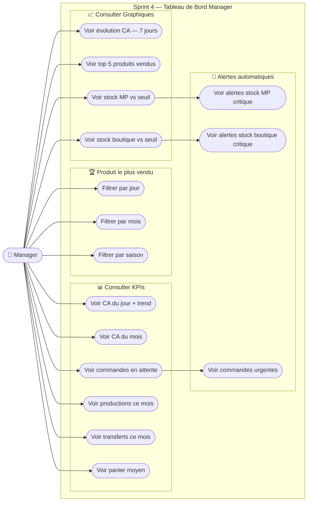
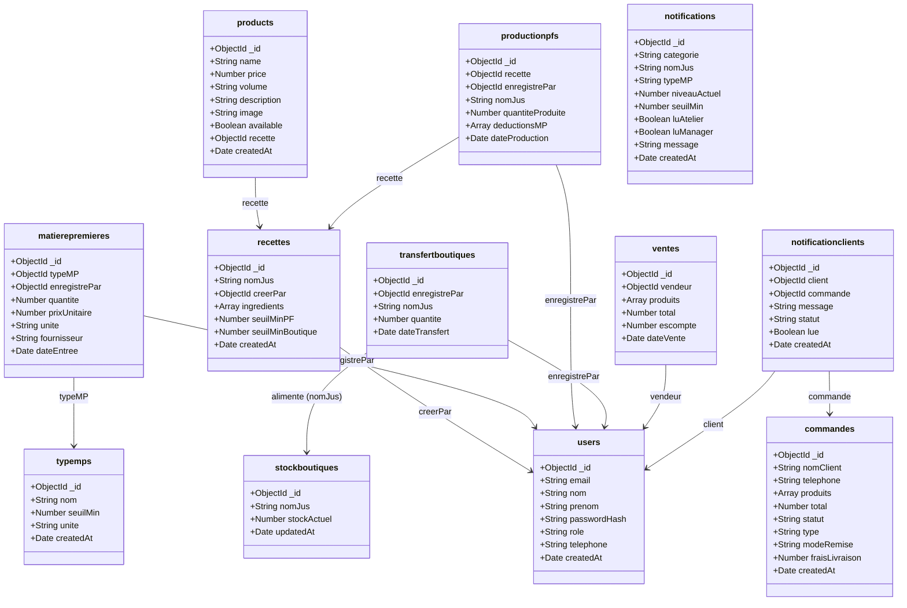
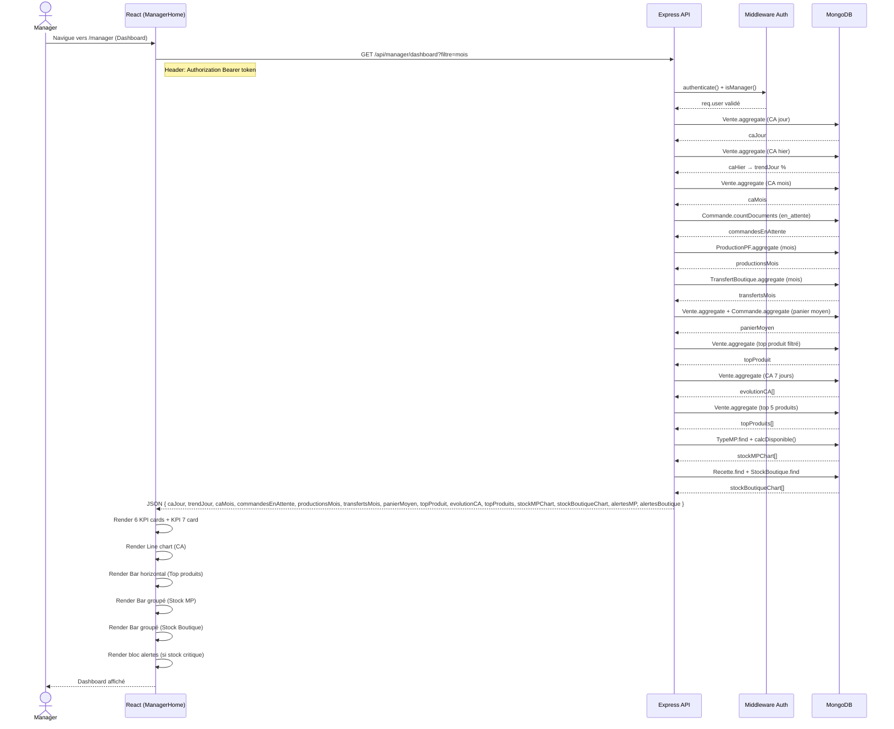
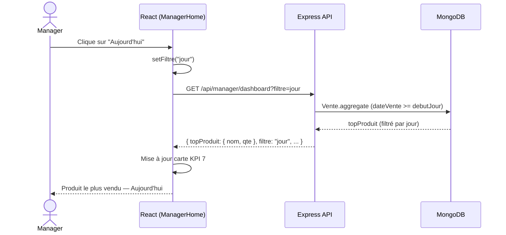

# Rapport Sprint 4 — SmartJuice
**Tableau de bord Manager (Dashboard)**

---

## 1. Informations générales

| Champ | Détail |
|-------|--------|
| Projet | SmartJuice — Système de gestion de production et vente de jus |
| Sprint | Sprint 4 |
| Objectif principal | Implémentation du tableau de bord manager avec KPIs et graphiques |
| Méthodologie d'analyse | GIMSI (Globalisation, Identification, Modélisation, Sélection, Intégration) |
| Stack technique | React 19 + Vite / Node.js + Express / MongoDB + Mongoose |
| Date | Avril 2026 |

---

## 2. Objectif du Sprint

Implémenter un **tableau de bord décisionnel** pour le manager permettant de :
- Visualiser les **7 KPIs** clés de l'activité en temps réel
- Analyser l'**évolution du chiffre d'affaires** sur 7 jours
- Identifier les **produits les plus vendus** avec filtre dynamique
- Surveiller les **niveaux de stock** (matières premières + boutique) via des graphiques
- Recevoir des **alertes automatiques** en cas de stock critique

---

## 3. Analyse GIMSI

### G — Globalisation *(Comprendre l'environnement)*

SmartJuice est une entreprise de production et vente de jus frais opérant sur deux niveaux :
- **Atelier** : production de jus à partir de matières premières
- **Boutique** : vente directe et gestion des commandes clients

Le manager supervise l'ensemble de la chaîne : approvisionnement → production → transfert → vente.

### I — Identification *(Acteurs et besoins décisionnels)*

| Acteur | Besoin | Décision à prendre |
|--------|--------|-------------------|
| Manager | Suivre les revenus quotidiens et mensuels | Ajuster les prix / promotions |
| Manager | Surveiller le stock MP | Déclencher le réapprovisionnement |
| Manager | Surveiller le stock boutique | Planifier les transferts |
| Manager | Valider les commandes en attente | Accepter / refuser |
| Manager | Suivre la production | Planifier les sessions de production |
| Manager | Identifier les produits phares | Orienter la production |

### M — Modélisation *(Processus métier)*

```
Fournisseur
    ↓
[matierepremieres]
    ↓
[productionpfs] ←── [recettes]
    ↓
[transfertboutiques]
    ↓
[stockboutiques] ──→ [ventes]
                          ↑
                    [commandes]
```

### S — Sélection *(7 KPIs retenus)*

| # | KPI | Axe | Collection source | Décision |
|---|-----|-----|------------------|---------|
| 1 | CA du jour + trend % vs hier | Financier | `ventes` | Performance quotidienne |
| 2 | CA du mois | Financier | `ventes` + `commandes` livrées | Objectif mensuel |
| 3 | Commandes en attente | Opérationnel | `commandes` | Valider / refuser |
| 4 | Productions ce mois (L) | Production | `productionpfs` | Relancer la production ? |
| 5 | Transferts ce mois (L) | Logistique | `transfertboutiques` | Réapprovisionner boutique ? |
| 6 | Panier moyen | Commercial | `ventes` + `commandes` | Ajuster les prix |
| 7 | Produit le plus vendu | Commercial | `ventes.produits` + filtre jour/mois/saison | Orienter la production |

### I — Intégration *(Implémentation dans le SI)*

| Composant | Technologie |
|-----------|-------------|
| API backend | `GET /api/manager/dashboard?filtre=jour\|mois\|saison` |
| Agrégation MongoDB | Pipeline `$match`, `$group`, `$sort`, `$limit`, `$unwind` |
| Charts | Chart.js 4 + react-chartjs-2 (Line, Bar groupé, Bar horizontal) |
| Alertes | Calculées côté backend, affichées si stock < seuil |
| Filtre KPI 7 | Query param `filtre` → re-fetch dynamique |

---

## 4. Diagramme de Cas d'Utilisation (CU)



---

## 5. Diagramme de Classes



---

## 6. Diagramme de Séquence

### Scénario principal : Chargement du tableau de bord



### Scénario secondaire : Changement de filtre KPI 7



---

## 7. Architecture technique

### Backend

```
server/
└── src/
    ├── controllers/
    │   └── workshopController.js   ← getDashboardKPIs()
    ├── routes/
    │   └── managerStockRoutes.js   ← GET /dashboard
    └── models/
        ├── Vente.js
        ├── Commande.js
        ├── ProductionPF.js
        ├── TransfertBoutique.js
        ├── StockBoutique.js
        ├── Recette.js
        ├── MatierePremiere.js
        └── TypeMP.js
```

**Endpoint :**
```
GET /api/manager/dashboard?filtre=jour|mois|saison
Headers: Authorization: Bearer <token>
Rôle requis: manager
```

**Réponse JSON :**
```json
{
  "caJour": 450.00,
  "caHier": 380.00,
  "trendJour": 18.4,
  "caMois": 12500.00,
  "commandesEnAttente": 3,
  "productionsMois": 240.5,
  "transfertsMois": 180.0,
  "panierMoyen": 35.20,
  "topProduit": { "nom": "Jus Orange", "qte": 85 },
  "filtre": "mois",
  "evolutionCA": [{ "date": "2026-04-13", "total": 320 }, "..."],
  "topProduits": [{ "_id": "Jus Orange", "totalQte": 320 }, "..."],
  "stockMPChart": [{ "nom": "Orange", "disponible": 45, "seuil": 20, "unite": "kg" }, "..."],
  "stockBoutiqueChart": [{ "nom": "Jus Orange", "disponible": 8, "seuil": 10 }, "..."],
  "alertesMP": [],
  "alertesBoutique": [{ "nom": "Jus Orange", "disponible": 8, "seuil": 10 }]
}
```

### Frontend

```
client/src/pages/
├── ManagerHome.jsx    ← Dashboard principal
└── ManagerHome.css    ← Design premium
```

**Composants Chart.js utilisés :**

| Chart | Type | Données |
|-------|------|---------|
| CA 7 jours | `Line` (courbe + gradient fill) | `evolutionCA` |
| Top 5 produits | `Bar` (horizontal) | `topProduits` |
| Stock MP | `Bar` (groupé, rouge/vert) | `stockMPChart` |
| Stock Boutique | `Bar` (groupé, rouge/bleu) | `stockBoutiqueChart` |

---

## 8. Fonctionnalités implémentées

| # | Fonctionnalité | Statut |
|---|---------------|--------|
| 1 | KPI CA du jour avec trend % vs hier | ✅ |
| 2 | KPI CA du mois (ventes + commandes livrées) | ✅ |
| 3 | KPI Commandes en attente | ✅ |
| 4 | KPI Productions ce mois (litres) | ✅ |
| 5 | KPI Transferts ce mois (litres) | ✅ |
| 6 | KPI Panier moyen du mois | ✅ |
| 7 | KPI Produit le plus vendu + filtre jour/mois/saison | ✅ |
| 8 | Line chart CA évolution 7 jours (gradient fill) | ✅ |
| 9 | Bar horizontal Top 5 produits vendus | ✅ |
| 10 | Bar groupé Stock MP vs seuil (rouge si critique) | ✅ |
| 11 | Bar groupé Stock Boutique vs seuil (rouge si critique) | ✅ |
| 12 | Bloc alertes automatiques (MP + boutique + commandes) | ✅ |
| 13 | Hover animation sur les KPI cards | ✅ |
| 14 | Badge trend ↑↓ coloré sur CA du jour | ✅ |
| 15 | Dashboard ajouté dans la navigation manager | ✅ |

---

## 9. Design System

| Élément | Valeur |
|---------|--------|
| Border radius | 16px |
| Shadow | `0 1px 6px rgba(0,0,0,0.04)` |
| Shadow hover | `0 8px 24px rgba(0,0,0,0.09)` |
| Hover animation | `translateY(-3px)` |
| Couleur positive | `#16a34a` (vert) |
| Couleur négative | `#dc2626` (rouge) |
| Couleur warning | `#ea580c` (orange) |
| Police | Segoe UI, Arial, sans-serif |
| Background | `#f8fafc` |

---

## 10. Retrospective Sprint 4

### Ce qui a bien fonctionné
- Agrégation MongoDB efficace via pipelines
- Design cohérent avec le reste de l'application
- GIMSI a permis de sélectionner des KPIs réellement actionnables
- Filtre dynamique jour/mois/saison sur le produit le plus vendu

### Points d'amélioration
- Ajouter une mise à jour automatique (polling ou WebSocket)
- Ajouter l'export PDF/Excel du rapport
- Ajouter la comparaison mois N vs mois N-1 sur le CA mensuel

---

*Rapport généré pour le Sprint 4 — SmartJuice*
