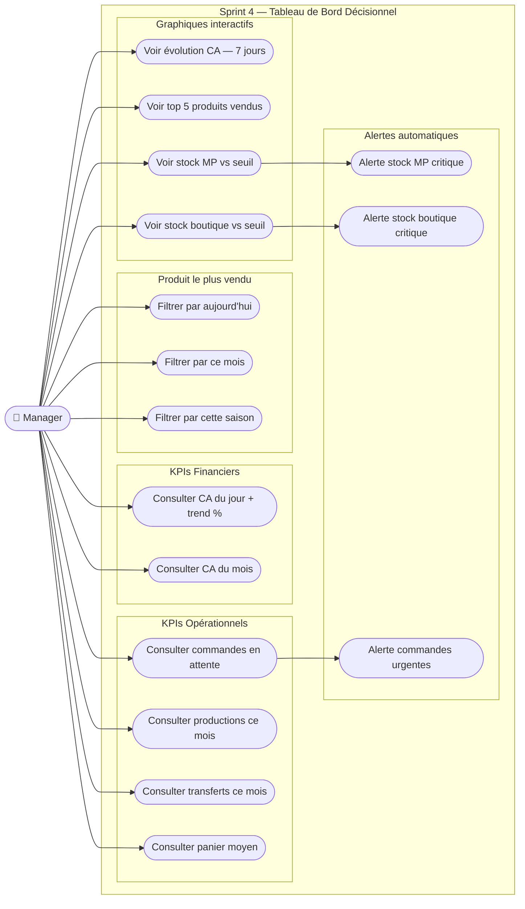
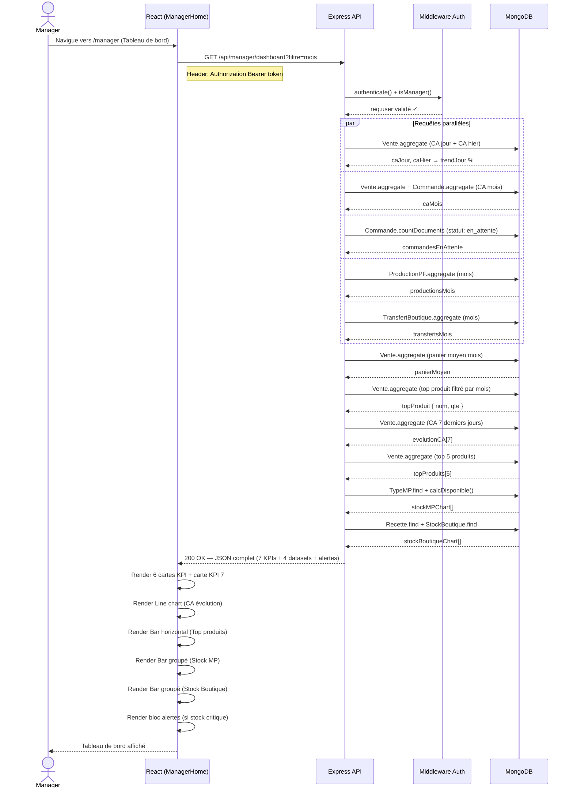
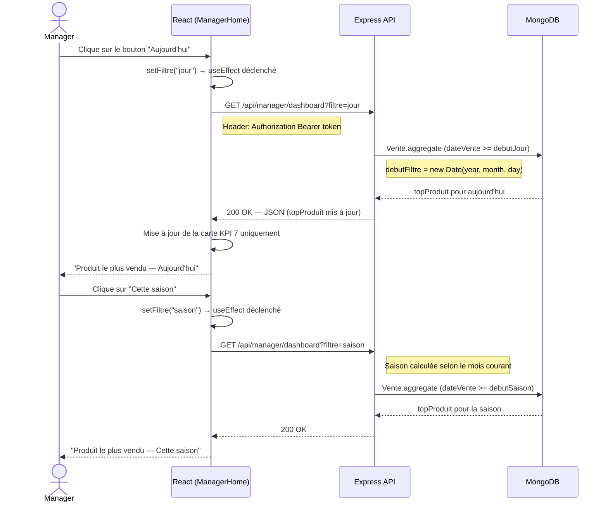
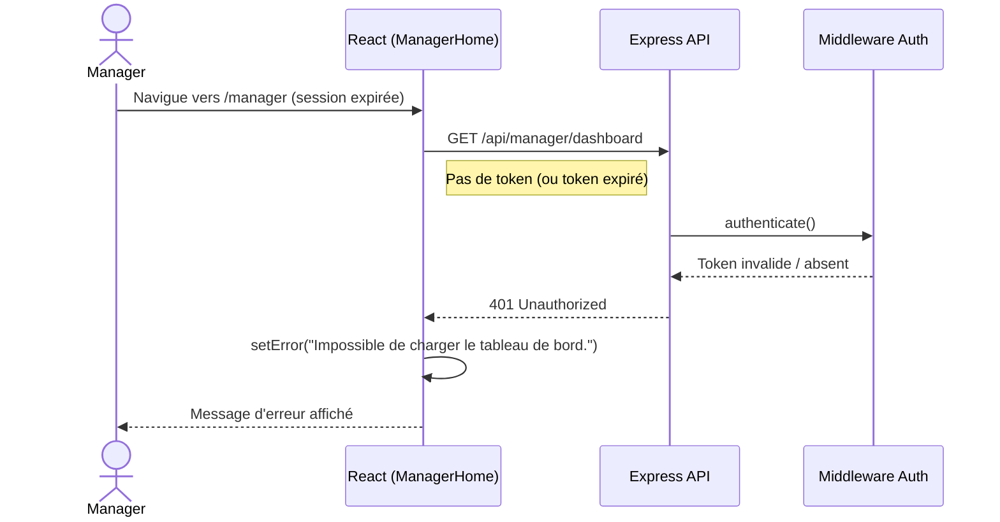
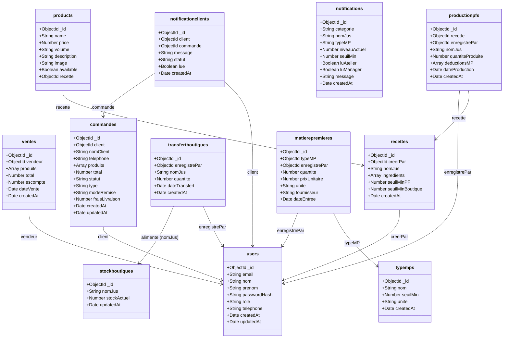
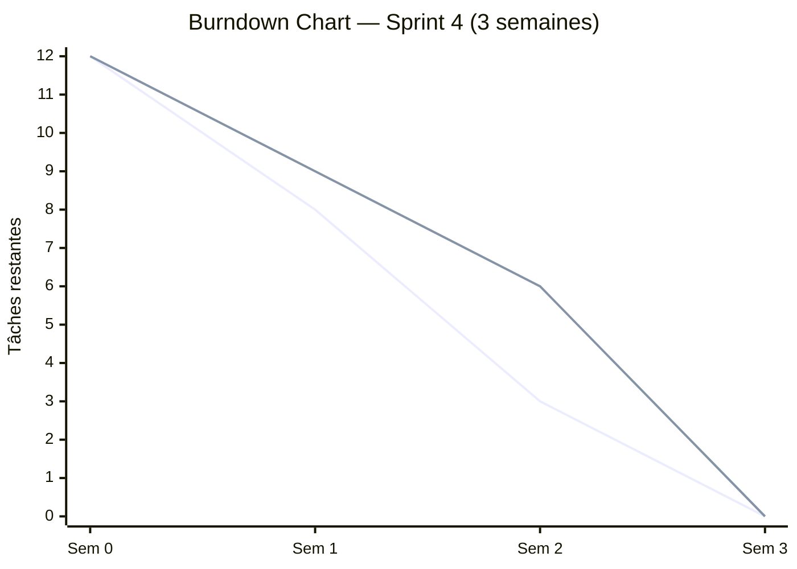

# Chapitre 5 : Sprint 4 — Tableau de Bord Décisionnel Manager

---

## Introduction

Ce sprint constitue le module de **Business Intelligence** de l'application SmartJuice. Il vise à offrir au manager un tableau de bord décisionnel complet lui permettant de piloter l'activité en temps réel à travers des indicateurs clés de performance (KPIs) et des visualisations graphiques interactives. L'analyse des besoins a été conduite selon la méthodologie **GIMSI** afin de sélectionner des indicateurs réellement actionnables et alignés sur les décisions métier du manager.

---

## 5.1 Backlog du Sprint 4

| ID | User Story | Priorité | Complexité |
|----|-----------|----------|-----------|
| PB1 | En tant que manager, je veux consulter les KPIs financiers (CA du jour avec tendance vs hier, CA du mois) afin de suivre la performance économique de l'activité | 1 — Haute | Élevée |
| PB2 | En tant que manager, je veux consulter les KPIs opérationnels (commandes en attente, productions du mois, transferts du mois, panier moyen) afin de superviser la chaîne d'activité | 1 — Haute | Moyenne |
| PB3 | En tant que manager, je veux identifier le produit le plus vendu avec un filtre dynamique (aujourd'hui / ce mois / cette saison) afin d'orienter la production | 2 — Moyenne | Élevée |
| PB4 | En tant que manager, je veux visualiser l'évolution du CA sur 7 jours, le top 5 produits et les niveaux de stock via des graphiques interactifs afin d'analyser les tendances | 1 — Haute | Élevée |
| PB5 | En tant que manager, je veux recevoir des alertes automatiques lorsque le stock MP ou le stock boutique est sous le seuil minimum afin d'agir rapidement | 2 — Moyenne | Moyenne |

---

## 5.2 Spécification des Cas d'Utilisation

### 5.2.1 Acteur principal

**Manager** : supervise l'ensemble de l'activité SmartJuice (production, ventes, stocks, commandes).

### 5.2.2 Cas d'utilisation identifiés

| CU | Intitulé | Précondition | Résultat |
|----|---------|-------------|---------|
| CU1 | Consulter les KPIs financiers | Connecté en tant que manager | CA jour (+ trend), CA mois affichés |
| CU2 | Consulter les KPIs opérationnels | Connecté en tant que manager | 4 KPIs (commandes, productions, transferts, panier moyen) affichés |
| CU3 | Consulter le produit le plus vendu | Connecté en tant que manager | Top produit avec filtre jour/mois/saison |
| CU4 | Visualiser l'évolution du CA | Connecté en tant que manager | Graphique linéaire sur 7 jours |
| CU5 | Visualiser le top 5 produits vendus | Connecté en tant que manager | Graphique bar horizontal |
| CU6 | Visualiser le stock MP vs seuil | Connecté en tant que manager | Graphique bar groupé (rouge si critique) |
| CU7 | Visualiser le stock boutique vs seuil | Connecté en tant que manager | Graphique bar groupé (rouge si critique) |
| CU8 | Recevoir les alertes de stock critique | Stock < seuil minimum | Bloc alertes affiché (rouge/orange) |

### 5.2.3 Diagramme de Cas d'Utilisation



---

## 5.3 Analyse GIMSI

La méthodologie **GIMSI** (Globalisation, Identification, Modélisation, Sélection, Intégration) a guidé la conception du tableau de bord afin de garantir que chaque indicateur soit pertinent, mesurable et actionnable.

### G — Globalisation *(Comprendre l'environnement)*

SmartJuice est une entreprise de production et vente de jus frais opérant sur deux niveaux :
- **Atelier** : transformation des matières premières en jus finis
- **Boutique** : vente directe et gestion des commandes clients en ligne

Le manager supervise l'intégralité de la chaîne : approvisionnement → production → transfert → vente.

### I — Identification *(Acteurs et besoins décisionnels)*

| Acteur | Besoin informationnel | Décision à prendre |
|--------|----------------------|-------------------|
| Manager | Suivre les revenus quotidiens | Ajuster les prix ou déclencher des promotions |
| Manager | Suivre les revenus mensuels | Évaluer l'atteinte des objectifs |
| Manager | Connaître les commandes en attente | Valider ou refuser rapidement |
| Manager | Suivre la production du mois | Planifier de nouvelles sessions de production |
| Manager | Suivre les transferts atelier→boutique | Anticiper les ruptures en boutique |
| Manager | Identifier les produits phares | Orienter la stratégie de production |
| Manager | Surveiller les niveaux de stock | Déclencher le réapprovisionnement MP ou les transferts |

### M — Modélisation *(Processus métier)*

Le processus métier de SmartJuice suit la chaîne suivante :

```
Fournisseur
    ↓
[matierepremieres]  ←── [typemps]
    ↓
[productionpfs]  ←── [recettes]
    ↓
[transfertboutiques]
    ↓
[stockboutiques]  ──→  [ventes]
                             ↑
                        [commandes]  ←── [users] (clients)
```

### S — Sélection *(7 KPIs retenus)*

| # | KPI | Axe | Collection source | Décision associée |
|---|-----|-----|------------------|------------------|
| 1 | CA du jour + trend % vs hier | Financier | `ventes` | Performance quotidienne |
| 2 | CA du mois | Financier | `ventes` + `commandes` livrées | Objectif mensuel atteint ? |
| 3 | Commandes en attente | Opérationnel | `commandes` | Valider / refuser |
| 4 | Productions ce mois (L) | Production | `productionpfs` | Relancer la production ? |
| 5 | Transferts ce mois (L) | Logistique | `transfertboutiques` | Réapprovisionner la boutique ? |
| 6 | Panier moyen | Commercial | `ventes` + `commandes` | Ajuster les prix / promotions |
| 7 | Produit le plus vendu | Commercial | `ventes.produits` + filtre | Orienter la production |

> **Zone optimale GIMSI : 7 KPIs** — au-delà de 12, surcharge cognitive ; en dessous de 5, vision incomplète.

### I — Intégration *(Implémentation dans le système d'information)*

| Composant | Technologie | Détail |
|-----------|-------------|--------|
| API REST | Node.js / Express | `GET /api/manager/dashboard?filtre=jour\|mois\|saison` |
| Agrégation | MongoDB Aggregation Pipeline | `$match`, `$group`, `$sort`, `$limit`, `$unwind` |
| Graphiques | Chart.js 4 + react-chartjs-2 | Line, Bar (horizontal + groupé) |
| Alertes | Calcul backend | Stock < seuil → `alertesMP[]` + `alertesBoutique[]` |
| Filtre dynamique | Query param `?filtre` | Re-fetch React au changement |
| Sécurité | JWT Bearer Token | Middleware `authenticate` + `isManager` |

---

## 5.4 Diagrammes de Séquence

### Scénario principal — Chargement du tableau de bord



### Scénario alternatif — Changement de filtre KPI 7



### Scénario alternatif — Accès sans token



---

## 5.5 Diagramme de Classes

Le diagramme ci-dessous représente les **collections MongoDB** effectivement utilisées dans le Sprint 4, avec leurs champs réels et leurs relations logiques.



---

## 5.6 Implémentation

### 5.6.1 Architecture technique

**Endpoint API :**

```
GET /api/manager/dashboard?filtre=jour|mois|saison
Authorization: Bearer <token>
Rôle requis : manager
```

**Fichiers modifiés / créés :**

| Fichier | Rôle |
|---------|------|
| `server/src/controllers/workshopController.js` | Fonction `getDashboardKPIs` — calcul des 7 KPIs + 4 datasets |
| `server/src/routes/managerStockRoutes.js` | Route `GET /dashboard` avec middlewares |
| `client/src/pages/ManagerHome.jsx` | Composant React — rendu du tableau de bord |
| `client/src/pages/ManagerHome.css` | Styles premium du dashboard |
| `client/src/components/ManagerLayout.jsx` | Ajout "Tableau de bord" dans la navigation |

**Structure de la réponse JSON :**

```json
{
  "caJour": 450.00,
  "caHier": 380.00,
  "trendJour": 18.4,
  "caMois": 12500.00,
  "commandesEnAttente": 3,
  "productionsMois": 240.50,
  "transfertsMois": 180.00,
  "panierMoyen": 35.20,
  "topProduit": { "nom": "Jus Orange", "qte": 85 },
  "filtre": "mois",
  "evolutionCA": [
    { "date": "2026-04-13", "total": 320.00 },
    { "date": "2026-04-14", "total": 450.50 }
  ],
  "topProduits": [
    { "_id": "Jus Orange", "totalQte": 320 },
    { "_id": "Jus Pomme", "totalQte": 245 }
  ],
  "stockMPChart": [
    { "nom": "Orange", "disponible": 45.50, "seuil": 20, "unite": "kg" }
  ],
  "stockBoutiqueChart": [
    { "nom": "Jus Orange", "disponible": 8.50, "seuil": 10 }
  ],
  "alertesMP": [],
  "alertesBoutique": [
    { "nom": "Jus Orange", "disponible": 8.50, "seuil": 10 }
  ]
}
```

### 5.6.2 Interfaces développées

**1. En-tête du tableau de bord**
- Titre "Tableau de bord" avec la date du jour localisée en français
- Fond gris clair (`#f8fafc`) pour différencier le tableau des autres pages

**2. Bloc d'alertes automatiques**
- Affiché uniquement si `alertesMP.length > 0` ou `alertesBoutique.length > 0` ou `commandesEnAttente > 0`
- Fond orange clair (`#fff7ed`), items colorés en rouge ou orange selon la criticité
- Affiche le nom du produit/MP concerné et les valeurs (disponible / seuil)

**3. Grille de 6 cartes KPI**

| KPI | Couleur | Icône | Particularité |
|-----|---------|-------|--------------|
| CA du jour | Bleu marine | Dollar | Badge trend ↑↓ (vert/rouge) |
| CA du mois | Teal | Écran | Ventes + commandes livrées |
| Commandes en attente | Orange / Vert | Sac | Orange si > 0, vert si = 0 |
| Productions ce mois | Violet | Grille | En litres |
| Transferts ce mois | Indigo | Flèches | Atelier → Boutique |
| Panier moyen | Rose | Panier | DT, arrondi à 2 décimales |

Chaque carte dispose d'un effet hover : élévation (`translateY(-3px)`) + ombre portée renforcée.

**4. Carte KPI 7 — Produit le plus vendu**
- Affiche le nom du produit et la quantité vendue
- 3 boutons filtre : Aujourd'hui / Ce mois / Cette saison
- Re-fetch automatique à chaque changement de filtre
- Bordure gauche ambre (`#f59e0b`)

**5. Graphique Ligne — Évolution CA 7 jours**
- Courbe lissée (`tension: 0.4`)
- Gradient fill du bleu marine vers transparent
- Points de données visibles (rayon 4px)
- Axe Y en DT, grille légère (`#f5f5f5`)

**6. Graphique Bar Horizontal — Top 5 Produits**
- `indexAxis: "y"` pour orientation horizontale
- 5 couleurs distinctes par produit
- Quantités en litres (L)

**7. Graphique Bar Groupé — Stock MP vs Seuil**
- 2 barres par matière première : Disponible + Seuil minimum
- Barre "Disponible" en rouge si `disponible < seuil`, en teal sinon
- Barre "Seuil" en gris léger semi-transparent

**8. Graphique Bar Groupé — Stock Boutique vs Seuil**
- Même logique que le stock MP
- Barre "Disponible" en rouge si critique, en bleu marine sinon
- Lecture immédiate : rouge = action requise

### 5.6.3 Design System

| Élément | Valeur |
|---------|--------|
| Border radius (cartes) | `16px` |
| Ombre normale | `0 1px 6px rgba(0,0,0,0.04)` |
| Ombre hover | `0 8px 24px rgba(0,0,0,0.09)` |
| Animation hover | `translateY(-3px)` — transition 0.18s |
| Fond général | `#f8fafc` |
| Couleur principale | `#1e3a5f` (bleu marine) |
| Trend positif | `#16a34a` (vert) sur fond `#f0fdf4` |
| Trend négatif | `#dc2626` (rouge) sur fond `#fef2f2` |
| Alerte rouge | fond `#fee2e2`, texte `#991b1b` |
| Alerte orange | fond `#ffedd5`, texte `#92400e` |
| Police | Segoe UI, Arial, sans-serif |

**Points de rupture responsive :**

| Breakpoint | Comportement |
|-----------|-------------|
| `< 1100px` | Graphiques en colonne unique |
| `< 700px` | Grille KPI = 2 colonnes, padding réduit |
| `< 420px` | Grille KPI = 1 colonne |

---

## 5.7 Tests

Les tests ont été réalisés via **Postman** sur l'endpoint `GET /api/manager/dashboard`.

| # | Cas de test | Données d'entrée | Résultat attendu | Résultat obtenu | Statut |
|---|------------|-----------------|-----------------|----------------|--------|
| 1 | Chargement dashboard (token valide, filtre=mois) | Bearer token manager valide | HTTP 200 — JSON complet (7 KPIs + 4 datasets) | JSON retourné avec tous les champs | **Conforme** |
| 2 | Chargement sans token | Aucun header Authorization | HTTP 401 Unauthorized | `{"message": "Non autorisé"}` | **Conforme** |
| 3 | Chargement avec token d'un rôle non-manager | Bearer token vendeur | HTTP 403 Forbidden | `{"message": "Accès refusé"}` | **Conforme** |
| 4 | Filtre = "jour" | `?filtre=jour` | `topProduit` calculé sur la journée courante | Top produit du jour retourné | **Conforme** |
| 5 | Filtre = "saison" | `?filtre=saison` (mois d'avril → printemps) | `topProduit` calculé depuis le 1er mars | Top produit de la saison retourné | **Conforme** |
| 6 | Stock MP sous le seuil | MP disponible < `typemps.seuilMin` | `alertesMP` non vide, bar rouge en graphique | Alerte MP affichée avec nom et valeurs | **Conforme** |
| 7 | Stock boutique sous le seuil | `stockboutiques.stockActuel` < `recettes.seuilMinBoutique` | `alertesBoutique` non vide | Alerte boutique affichée | **Conforme** |
| 8 | Aucune vente enregistrée | Base vides | `caJour=0`, `trendJour=null`, `evolutionCA` avec 7 zéros | Valeurs nulles/zéro correctement gérées | **Conforme** |

---

## 5.8 Suivi Scrum

### Scrum Board (Trello)

Le Scrum Board du Sprint 4 est organisé en trois colonnes :

| À faire | En cours | Terminé |
|---------|---------|---------|
| — | — | Analyse GIMSI et sélection KPIs |
| — | — | Implémentation endpoint API dashboard |
| — | — | Calcul des 7 KPIs (backend) |
| — | — | Line chart CA 7 jours |
| — | — | Bar chart Top 5 produits |
| — | — | Bar groupé Stock MP |
| — | — | Bar groupé Stock Boutique |
| — | — | Carte KPI 7 avec filtre dynamique |
| — | — | Bloc alertes automatiques |
| — | — | Design premium (hover, trend badge) |
| — | — | Intégration dashboard dans navigation manager |
| — | — | Tests Postman |

### Burndown Chart



> **Ligne bleue** : tâches planifiées à compléter | **Ligne orange** : tâches effectivement complétées
>
> Le sprint a été complété dans les délais prévus. La semaine 2 a concentré le plus de livraisons (implémentation graphiques + logique backend).

---

## Conclusion du Sprint 4

Le Sprint 4 a livré un **tableau de bord décisionnel complet** pour le manager SmartJuice, conforme aux principes de la méthodologie GIMSI. Les 7 KPIs sélectionnés couvrent les axes financier, opérationnel, production, logistique et commercial, offrant au manager une vision synthétique et actionnable de l'activité en temps réel.

Les graphiques interactifs (Chart.js 4) permettent une lecture visuelle immédiate des tendances et des alertes de stock. Le filtre dynamique (jour / mois / saison) sur le produit le plus vendu constitue un apport stratégique pour orienter la production selon la saisonnalité.

**Fonctionnalités livrées :** 12 indicateurs visuels (7 KPIs + 4 graphiques + bloc alertes), design premium responsive, re-fetch dynamique, alertes automatiques conditionnelles.

---

*Rapport Sprint 4 — SmartJuice | Institut Supérieur de Gestion de Sousse | Année universitaire 2025-2026*
*Réalisé par : Ayed Moetez & Lakhal Akthem | Encadrant académique : Dr. Hochlef Neila | Encadrant professionnel : Mme Chemli Weal*
